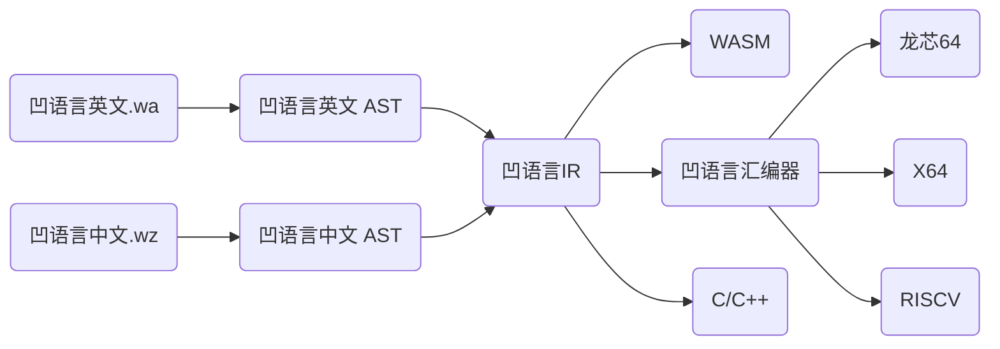

## 关于我

凹语言联合发起人，PLOC编程语言开放社区发起人，是中国编程语言、AI编译器、传统编译器、汇编器、ELF链接器、虚拟机、异构算子分发系统和WebAssembly等领域知名专家，人民邮电出版社最具影响力作者。同时也是信息学技术的传播者，致力于推动国产编程语言、国产芯片生态和少儿编程技术的发展。目前再尝试古法编程中。

## 古法编程(2026)

**忆江南·杭州浅忆**

——写于离杭一年之际

西湖好，唯独游客欢。

风尘五载杭城住，烟雨潮头意阑珊。

何必问归还。

**忆江南·回忆镇江**

——追记高中毕业暑假初次独行江南，倏忽二十余载。

高三毕，镇江独自行。

运河蜿蜒衔汽渡，焦山北固镇大江。

万里赴沧茫。

**忆江南.常熟沙家浜**

——大一岁暮，随哥嫂绕道常熟。秋日游沙家浜，芦叶枯黄，不闻戏台丝竹之声。碎碎念春风再绿之时景象…

沙家浜，秋至落叶黄。

丝竹悄然水无波，盼春风再绿河塘。

戏台正开张。

**忆江南·苏州宝带桥**

——年后赴苏州吴中办事，得闲暇，游历宝带桥。

宝带桥，回首望平生。

漫步长桥似远征，历尽烽烟景自呈。

前路起钟声。

## 十年小目标(2018-2030)

- 小目标：写10本书+做一个非玩具的语言，简称非常10+1。
- 小进展：已正式出版5本书；凹语言走过5年已完成全部语言特性，实现基于国产龙芯架构的编译器、汇编器、链接器全链路自研，处于生产试用阶段。

## 编程语言

- 凹语言(联合发起人): https://github.com/wa-lang/wa, https://wa-lang.org/
- Go语言(贡献者): https://github.com/golang/image/commits?author=chai2010, https://github.com/golang/go/blob/go1.2/CONTRIBUTORS#L115

玩具语言:

- uGo玩具语言: https://github.com/wa-lang/ugo
- 狗头玩具语言: https://github.com/chai2010/gotlang
- Tiny玩具语言: https://github.com/chai2010/tinylang

## 图书作品

已经出版：

- 《Go语言高级编程·第二版》-2025, 豆瓣: https://book.douban.com/subject/37436371/
- 《Go语言定制指南》- 2022, 5.4K Star: https://github.com/chai2010/go-ast-book
- 《面向WebAssembly编程》- 2020, 1.4K Star: https://github.com/3dgen/cppwasm-book
- 《Go语言高级编程》-2019, 19.5K Star: https://github.com/chai2010/advanced-go-programming-book
- 《WebAssembly标准入门》- 2018: https://github.com/chai2010/wasm-book-code

图书翻译:

- 《Go语言圣经》- 2015, 4.5K Star: https://gopl-zh.github.io
- 《学习OpenCV》- 2009: https://book.douban.com/subject/4033320

暂停中：

- 《Go和大语言模型编程》- 暂停: https://github.com/chai2010/llmgo-book
- 《µGo语言实现》- 暂停, 1.5K Star: https://github.com/wa-lang/ugo-compiler-book

## 次要作品

- [wat-go](https://github.com/chai2010/wat-go): WebAssembly文本格式工具
- [WaBook](https://github.com/wa-lang/wabook) - Go语言实现的电子书和在线PPT生成，已经服务于我的多个项目
- [tiff](https://github.com/chai2010/tiff) - Go语言实现的TIFF解码库，10年前作品
- [webp](https://github.com/chai2010/webp) - 基于CGO封装的WebP图像编解码库，被多个图像处理工具依赖
- [gettext-go](https://github.com/chai2010/gettext-go) - Go语言的多语言支持库，**被K8S依赖**，10年前作品
- [pbgo](https://github.com/chai2010/pbgo) - 基于Protobuf封装的迷你Web框架，支持protoc插件生成框架代码
- [cc-mini-test](https://github.com/chai2010/cc-mini-test) - 迷你版的C++测试库，只有2个独立文件，可替代GTest
- [defer](https://github.com/chai2010/defer) - 为C++定制的defer宏
- [opencv-go](https://github.com/chai2010/opencv) - Go社区第一个基于CGO封装的OpenCV库，10年前作品
- [莆田医院](https://github.com/chai2010/ptyy) - 基于Go开发的iOS应用
- [protorpc](https://github.com/chai2010/protorpc) - 基于Protobuf的RPC框架，支持Go/C++跨语言通信，支持protoc插件
- [base60](https://github.com/chai2010/base60): 自主设计的天干地支编码: 乙丑癸巳甲寅己亥丁卯甲申丁未甲午己巳
- [im4corner](https://github.com/chai2010/im4corner): Google输入法四角号码扩展
- [vimpinyin](https://github.com/chai2010/vimpinyin): Vim拼音输入法

## 技术分享

- 2025 - [凹语言社区现状和未来展望](https://wa-lang.org/talks/wa-os2atc-2025/) - 北京 OS2ATC 2025 编程语言分论坛
- 2024 - [开源社区的黑暗思考](https://mp.weixin.qq.com/s/tuoRvoW0zkv--ls6z7hpRA) - 宁波开源“火种”项目发布暨开源社建设交流研讨会
- 2024 - [凹语言map与Φ指令的纠葛](https://wa-lang.org/talks/ssa-bug/) - 上海
- 2021 - [如何基于Go语言和Go编译器定制语言](https://wa-lang.org/ugo-compiler-book/talks/go-compiler-intro.html) - 线上
- 2018 - [深入CGO编程](https://chai2010.cn/gopherchina2018-cgo-talk/) GopherChina·上海
- 2018 - [Go&WebAssembly简介](https://github.com/golang-china/awesome-go-zh/blob/master/chai2010/chai2010-golang-wasm.slide) - Go·夜读
- 2018 - [Go语言将走向何方](https://github.com/golang-china/awesome-go-zh/tree/master/chai2010/giac2018) GIAC上海
- 2018 - [Go语言并发编程](https://github.com/golang-china/awesome-go-zh/blob/master/chai2010/chai2010-golang-concurrency.slide) 武汉·光谷猫友会
- 2011 - [Go集成C/C++代码](https://github.com/chai2010/gopherchina2018-cgo-talk/blob/master/chai2010-cgo-talk-sz-20110207.pdf) 珠三角技术沙龙深圳

## 媒体报道

- 文汇报2024/8/31期: [凹语言联合发起人柴树杉——「爱好者」不为难，抢占编程语言话语权](https://dzb.whb.cn/imgPath/2024-08-29/40829.pdf)
- 劳动报2023/12/27期：[劳动报 2023上海城市数字化转型“智慧工匠”选树、“领军先锋”评选活动表彰名单](https://www.zhihuigongjiang.org/histroy.html)

## 联系方式

- 微信: `chaishushan-weixin`
- 邮箱: `chaishushan{AT}gmail.com`
- 博客: https://chai2010.cn/

<!--
**chai2010/chai2010** is a ✨ _special_ ✨ repository because its `README.md` (this file) appears on your GitHub profile.

Here are some ideas to get you started:

- 🔭 I’m currently working on ...
- 🌱 I’m currently learning ...
- 👯 I’m looking to collaborate on ...
- 🤔 I’m looking for help with ...
- 💬 Ask me about ...
- 📫 How to reach me: ...
- 😄 Pronouns: ...
- ⚡ Fun fact: ...
-->
